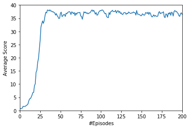

### Objective of the project

The objective of the project is to train double-jointed arms to reach target locations and to maintain its position on the target as long as possible. The project must be applied to a mutli-agent configuration, containing 20 agents.

The observation space provided by the environment to each agent is a 33-D state vector with continuous variables. The state vector provides variables related to position, rotation, velocity, Rand angular velocities of the arm.

The action space is 4-D space vector, corresponding to torque applicable to two joints. The continuous value of each variable must fit the [-1, +1] interval.

A reward of +0.1 is obtained by each agent at each time step that the agent's hand is located to the target, such as more the agent's hand follows the target more the agent will receive a high cumulative reward.

To solve the environment, the average score over 100 episodes and all the agents must reach +30. The score of an episod is the average score over the 20 agents. 

### Description of the algorithm
We use the DDPG (Deep Deterministic Policy Gradient) algorithm in which two networks must be trained to learn:
- the best action to achieve in any state: the actor network
- the expected value related to any state: the critic network
For a given the state, The actor provides the probability for each action, while the critic network provides the expected value of each state.

As in the DQN algorithm, the algorithm used an experience replay buffer which allows to store the tuple `(state, action, reward, next state)` of each agent at each time step. It is a FIFO queue where the size is an hyperparameter.

A noise process is used to encourage exploration by adding some noise, thanks to the Ornstein-Uhlenbeck process, to the selected action vector. 

We describe hereafter the training procedure:

1. A 33-D state vector is provided to each agent
2. Each agent select an action by feeding the actor network with its state vector
3. Noise, obtained with the Ornstein-Uhlenbeck process, is added to action vectors
4. After executing actions, the environment provides for each agent a reward and a next state vector
5. The experience replay buffer is fed with the tuple `(state, action, reward, next state)` of each agent
6. The experience replay buffer is sampled to extract a batch of tuples
7. The local actor network weights are updated by using the predicted states value provided by the critic
8. The local critic network weights are updated by using the predicted states value and the target critic
9. both actor and critic targets are updated with soft-update thanks to their local networks

### Actor and critic neural networks architecture

The actor network is a stack of two hidden linear layers, followed by a ReLU function. The number of input neurons is the state space size (33), while the number of output neurons is the action space size (4). The activation function of the output layer is a `tanh` function, allowing continuous values of the action vector in the [-1, +1] interval.

The architecture of the critic network is a little bit more complex. Instead of directly stacking at the input action and state spaces, a first hidden layer is used with input only the state vector (33-D). Then, the ouput of this first layer is concatenated with action vector (4-D) to feed a second hidden layer. Finally, the output layer is 1 neuron, providing the estimated Q-value.

The size of the hidden layers of actor and critic networks are hyperparameters. In order to limit the number of parameters of the networks, they should be as small as possible. In our implementation all layer sizes are set to 128.

In addtion to architecture, we need to adjust hyperparameters related to the learning: 
- `LR_ACTOR = 0.0001` is the learning rate for the optimization procedure to update the local actor weights
- `LR_CRITIC = 0.001` is the learning rate for optimization procedure to update of the local critic weights

### Agent hyperparameters

These parameters are related to the Reinforcement learning procedure:
- `BUFFER_SIZE = 100000` is the maximum number tuples `(state, action, reward, next_state, done)` of the experience replay buffer.
- `GAMMA = 0.99` which control the discount factor, and so the "deep" of the reinforcement learning process.
- `TAU = 0.001` controls soft-update related to the target network parameters. Smaller `TAU` is, smaller is the weights update.
- `BATCH_SIZE = 128` is the number samples used to achieve the optimization process. 

### Results
We show on the figure below the average score computed over episodes obtained from the 20 agents with the DDPG algorithm and the network architectures describes above. The plotted average score is obtained from the average over 100 consecutive episodes (The first point is thus calculated after 100 episodes).
The target of +30 is reached after 125 episodes. Also, we observe a stability of the score which show that the system seems to be very stable. Finally the steady state score is around 37.

### Future perspectives

At this step, we only test the DDPG algorithm. It is important to test other algorithms 
